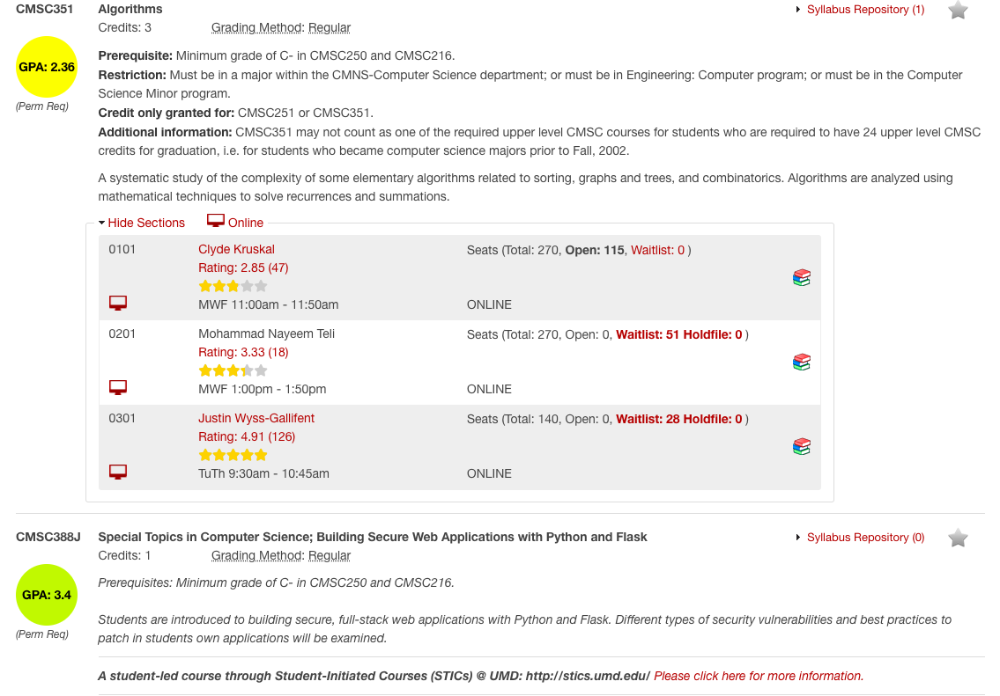

# UMDStats

This Google Chrome extension uses the PlanetTerp API to request information about a professor/course. It will then display the info on the UMD Schedule of Classes page. The average rating of the professor is displayed. The average GPA of the course is also displayed. A hyperlink will also appear, which links to reviews of the professor, if they exist on PlanetTerp. The extension calculates the average review by totaling all the available reviews and ratings on PlanetTerp and then dividing by the number of reviews. The average GPA is calculated similarly but with grade data instead.
 
 
The following is a link to the extension on the Google Web Store. (If it's not here, we are currently waiting for it to be accepted.) In the meantime, if you would like to use it, you should follow the instructions below!

### Instructions
1. Download the ZIP file.
2. Open Google Chrome and type this in the web bar --> **chrome://extensions/**
3. On the top right of the page, it isn't on already, you should turn on developer mode.
4. Then on the top left there should be a button calld "Load Unpacked" which you should click. Then find the UMDStats folder.
5. If you would like, you can turn off developer mode. But other that, the extension should work as intended!

### Example
Below you can find a picture of the extension in action! Feel free to send me a message if you have any questions!  
 
 
 
. 
  
  

